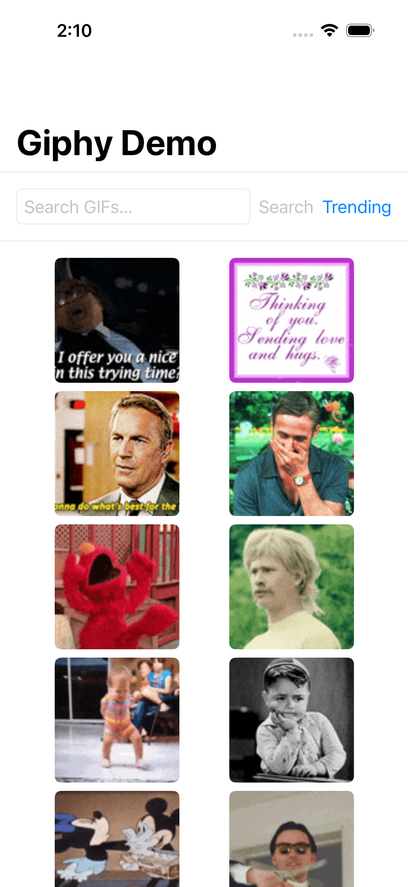
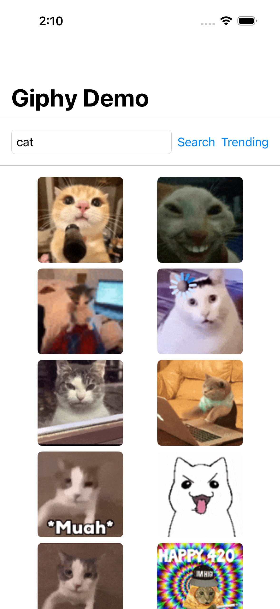
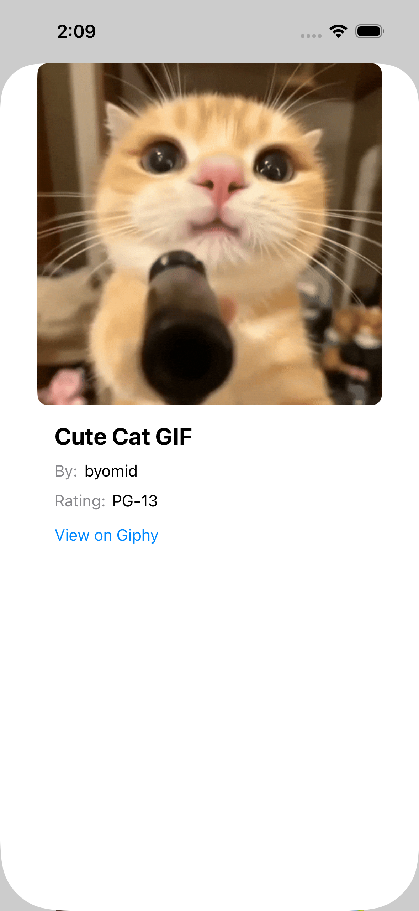
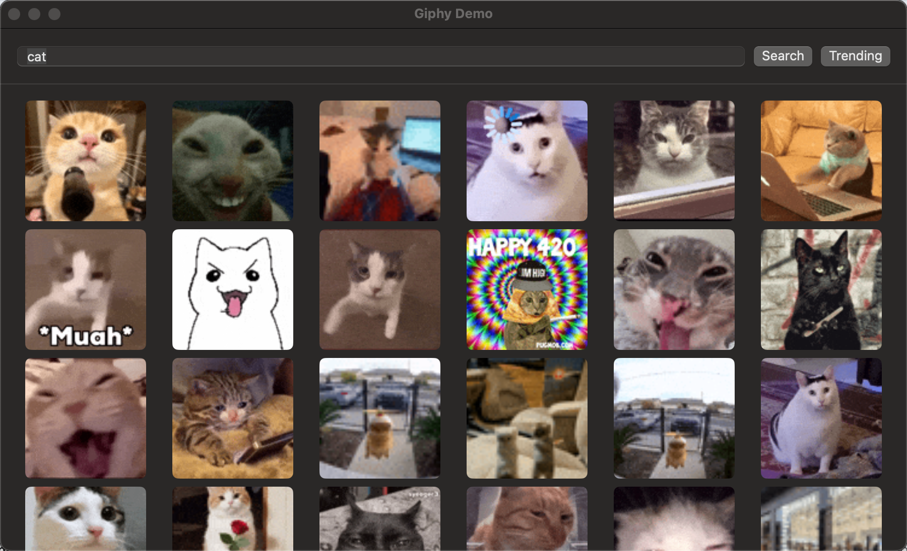
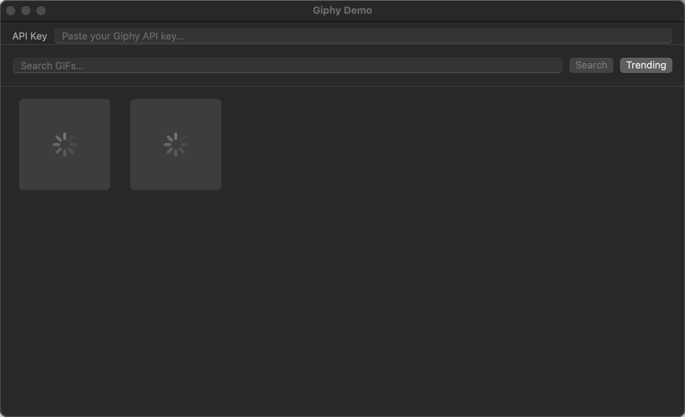

# AWGiphyServices

A dependency-free Swift Package for integrating the [Giphy API](https://developers.giphy.com/) in iOS and macOS apps.

**iOS 17+ · macOS 14+ · Swift Package**

---

## Features

- **GIF search** — query with limit, offset, and content rating
- **Trending GIFs** — fetch the current trending feed
- **Fetch by ID** — retrieve a single GIF
- **Batch fetch** — retrieve multiple GIFs by ID in one request
- **Random GIF** — fetch a random GIF, optionally filtered by tag
- **Image download** — download raw GIF/WebP/MP4 data
- **Protocol mixin pattern** — conform to `AWGiphyPhotosProtocol` and get all functionality for free; no subclassing or object injection required

## Installation

```swift
// In Package.swift
.package(url: "https://github.com/asafw/AWGiphyServices.git", from: "1.0.0")
```

Add `"AWGiphyServices"` to your target's dependencies.

## Quick start

```swift
import AWGiphyServices

let service = AWGiphyService()

// Search
let (gifs, pagination) = try await service.searchGIFs(
    apiKey: "YOUR_API_KEY",
    request: AWGiphySearchRequest(query: "cats", limit: 25)
)

// Trending
let (trending, _) = try await service.trendingGIFs(
    apiKey: "YOUR_API_KEY",
    request: AWGiphyTrendingRequest(limit: 25)
)

// Fetch by ID
let gif = try await service.getGIF(apiKey: "YOUR_API_KEY", id: "abc123")

// Batch fetch
let batch = try await service.getGIFs(apiKey: "YOUR_API_KEY", ids: ["abc123", "def456"])

// Random GIF (optionally filtered by tag)
let random = try await service.randomGIF(
    apiKey: "YOUR_API_KEY",
    request: AWGiphyRandomRequest(tag: "cats")
)

// Download image data
let data = try await service.downloadImageData(from: URL(string: gif.images.fixedHeight.url!)!)
```

## Protocol mixin pattern

Conform any type directly — no wrapper objects needed:

```swift
import AWGiphyServices
import Observation

@Observable final class MyViewModel: AWGiphyPhotosProtocol {
    // Optional: override to inject a custom URLSession
    // var urlSession: URLSession { myCustomSession }
}

// In a SwiftUI view:
let (gifs, _) = try await viewModel.searchGIFs(apiKey: key, request: req)
```

## API reference

### `AWGiphyPhotosProtocol`

| Method | Description |
|---|---|
| `searchGIFs(apiKey:request:)` | Search for GIFs by keyword |
| `trendingGIFs(apiKey:request:)` | Fetch the trending GIF feed |
| `getGIF(apiKey:id:)` | Fetch a single GIF by ID |
| `getGIFs(apiKey:ids:)` | Batch-fetch multiple GIFs by ID |
| `randomGIF(apiKey:request:)` | Fetch a single random GIF |
| `downloadImageData(from:)` | Download raw bytes from a GIF URL |

### Request types

| Type | Key properties |
|---|---|
| `AWGiphySearchRequest` | `query: String`, `limit: Int = 25`, `offset: Int = 0`, `rating: String?` |
| `AWGiphyTrendingRequest` | `limit: Int = 25`, `offset: Int = 0`, `rating: String?` |
| `AWGiphyRandomRequest` | `tag: String?`, `rating: String?` |

### Response types

| Type | Key properties |
|---|---|
| `AWGiphyGIF` | `id`, `title`, `slug`, `url`, `rating`, `username`, `images: AWGiphyImages`, `importDatetime?`, `createDatetime?` |
| `AWGiphyRandomGIF` | `id`, `title`, `rating`, `username`, `imageUrl?`, `imageOriginalUrl?` |
| `AWGiphyImages` | `fixedHeight`, `fixedHeightSmall`, `preview?`, `fixedWidth`, `original`, `downsized` (all `AWGiphyRendition`) |
| `AWGiphyRendition` | `url?`, `mp4?`, `webp?`, `width?`, `height?`; `widthInt`, `heightInt` computed |
| `AWGiphyPagination` | `count`, `offset`, `totalCount?` |

### Errors

```swift
public enum AWGiphyAPIError: Error, Equatable {
    case networkError             // URLSession transport error
    case parsingError             // JSON decoding failure
    case apiError(code: Int, message: String) // Non-2xx HTTP response
}
```

## Demo App

A demo app under `Examples/` exercises all four `AWGiphyPhotosProtocol` methods. The same SwiftUI source files run on both macOS and iOS.

### Screenshots

#### iOS

| Trending | Search results | GIF detail |
|:--------:|:--------------:|:----------:|
|  |  |  |

#### macOS

| Search results | GIF detail |
|:--------------:|:----------:|
|  |  |

### Running on macOS

```bash
# Option 1 — environment variable
GIPHY_API_KEY=your_api_key swift run GiphyDemoApp

# Option 2 — credential file
echo "your_api_key" > /tmp/GIPHY_API_KEY
swift run GiphyDemoApp
```

### Running on iOS (Simulator)

Requires [XcodeGen](https://github.com/yonaskolb/XcodeGen):

```bash
cd Examples/GiphyDemoApp-iOS
xcodegen generate
open GiphyDemoApp-iOS.xcodeproj
```

Set `GIPHY_API_KEY` in **Product → Scheme → Edit Scheme → Run → Arguments → Environment Variables**, then build and run.

### Regenerating screenshots

```bash
# iOS (requires iPhone 16 simulator)
bash scripts/ios_screenshots.sh

# macOS (requires cliclick: brew install cliclick)
GIPHY_API_KEY=your_key bash scripts/macos_screenshots.sh
```

---

## Testing

Integration tests require a Giphy API key and are skipped in CI automatically:

```bash
# Unit tests (no network, macOS)
xcodebuild -scheme AWGiphyServices-Package -destination "platform=macOS" \
    -only-testing:AWGiphyServicesTests test

# Integration tests (requires API key)
GIPHY_API_KEY=your_key xcodebuild -scheme AWGiphyServices-Package \
    -destination "platform=macOS" test
```

## License

MIT
